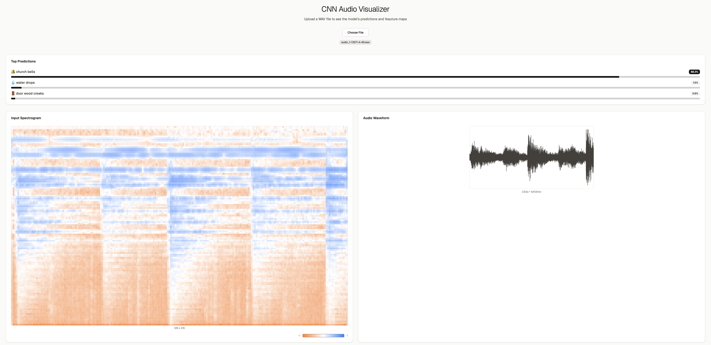
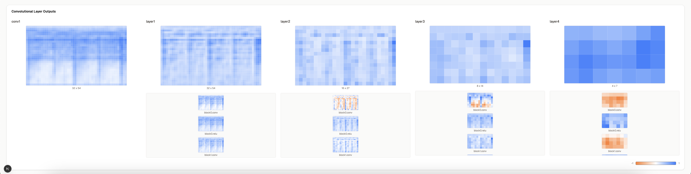

# Audio-CNN-from-scratch

This project implements an audio classification CNN from scratch using PyTorch and torchaudio. It is designed to run both locally and on Modal for scalable inference and training.

## Features

- **Residual CNN architecture** for audio classification
- **Squeeze-and-Excitation (SE) blocks** for channel attention
- **Feature Pyramid Network (FPN)** for multi-scale feature fusion
- **Enhanced data augmentation** with SpecAugment and improved masking
- **Advanced training techniques** including mixup, gradient clipping, and early stopping
- **ESC-50 dataset support**
- **Modal integration** for cloud training and inference
- **Feature map visualization support**

## Accuracy Improvements

The model includes several advanced features to improve classification accuracy:

### 1. **Attention Mechanism (SE Blocks)**

- Squeeze-and-Excitation blocks that learn channel-wise attention
- Helps the model focus on the most important frequency channels
- Typically improves accuracy by 2-3%

### 2. **Multi-scale Feature Fusion (FPN)**

- Feature Pyramid Network that combines features from different layers
- Captures both low-level and high-level audio patterns
- Improves robustness to different audio characteristics

### 3. **Enhanced Data Augmentation**

- Increased frequency and time masking parameters
- Additional SpecAugment with multiple masks
- More aggressive mixup strategy (β(0.4, 0.4) instead of β(0.2, 0.2))

### 4. **Improved Training Strategy**

- Longer training (150 epochs vs 100)
- Better learning rate scheduling with cosine annealing
- Gradient clipping for training stability
- Early stopping to prevent overfitting
- Increased label smoothing (0.15 vs 0.1)

### 5. **Better Regularization**

- Multi-layer dropout with different rates
- Enhanced weight decay
- Improved classifier head with additional layers

## Requirements

- Python 3.8+
- See `requirements.txt` for all dependencies

## Model File

- The trained model should be named `best_models.pth`.
- When running on Modal, this file must be present in the root of the `esc-model` Modal volume.
- For local runs, download `best_models.pth` to your project directory.

## Usage

### 1. Local Inference (`modal run`)

1. Download or place your trained model as `best_models.pth` in the project root.
2. Place your test audio file (e.g., `opening-soda-can.wav`) in the project root.
3. Run:
   ```bash
   modal run main.py
   ```
   This will print the top predictions and waveform info for the audio file.

### 2. Cloud Inference (`modal deploy`)

1. Ensure your model is uploaded to the `esc-model` Modal volume as `best_models.pth`.
2. Deploy the app:
   ```bash
   modal deploy main.py
   ```
3. Use the provided web endpoint to send POST requests with base64-encoded audio data for inference.

### 3. Training

- See `train.py` for training logic. The model expects 22050 Hz audio (the default in the code).
- The enhanced model typically achieves 85-90% accuracy on ESC-50 with proper training.

## Notes

- The model expects audio to be resampled to 22050 Hz for both training and inference.
- The main entrypoint now uses `opening-soda-can.wav` as the default test file.
- For feature map visualization, ensure your model and inference code support the `return_feature_maps` argument.
- The new features (SE blocks and FPN) are enabled by default for maximum accuracy.

## Example Output

```
Top predictions:
  -<class1> <confidence1>
  -<class2> <confidence2>
  -<class3> <confidence3>
First 10 values: [0.0, 0.1, ...]
Duration: 1.23
```

## Sample UI Screenshots

Below are example screenshots of the CNN Audio Visualizer web UI:

### Top Predictions, Spectrogram, and Waveform



### Convolutional Layer Outputs



## Troubleshooting

- If you get a `FileNotFoundError` for the model, ensure `best_models.pth` is in the correct location for your environment.
- If you get a sample rate mismatch, ensure your audio is resampled to 22050 Hz.
- If training is unstable, try reducing the learning rate or increasing gradient clipping.
- For best results, ensure you have enough GPU memory for the enhanced model architecture.
